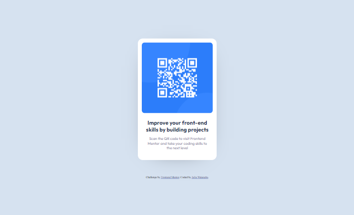

# Frontend Mentor - QR code component solution

This is a solution to the [QR code component challenge on Frontend Mentor](https://www.frontendmentor.io/challenges/qr-code-component-iux_sIO_H). Frontend Mentor challenges help you improve your coding skills by building realistic projects. 

## Table of contents

- [Overview](#overview)
  - [Screenshot](#screenshot)
  - [Links](#links)
- [My process](#my-process)
  - [Built with](#built-with)
  - [Useful resources](#useful-resources)
- [Author](#author)

## Overview

### Screenshot

**Mobile Version**

 

**Desktop Version**

### Links

- Solution URL: [solution link](https://github.com/juliawatanabe/frontend-mentor-challenges/tree/main/qr-code-component-main)
- Live Site URL: [live site link](https://charming-kitsune-2edb92.netlify.app/)

## My process

### Built with

- Semantic HTML5 markup
- CSS custom properties
- Flexbox
- Mobile-first workflow

### Useful resources

- [W3Schools](https://www.w3schools.com/) 
- [Mozilla](https://developer.mozilla.org/) 

I would always recommend both websites.

## Author

- Website - [Julia Watanabe](https://github.com/juliawatanabe)
- Frontend Mentor - [@juliawatanabe](https://www.frontendmentor.io/profile/juliawatanabe)
